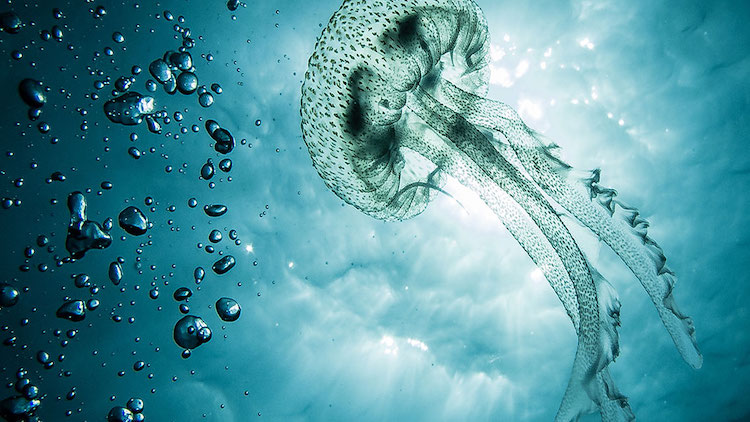
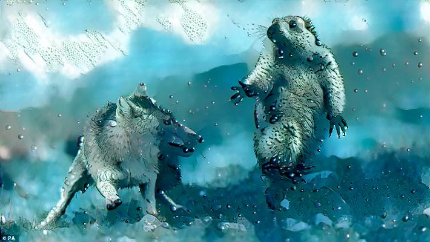

# Neural-Transformation-with-Pytorch

<table>
    <tr>
        <td>
            <h2>Content image</h2>
        </td>
        <td>
            <h2>Style image</h2>
        </td>
        <td>
            <h2>Output image</h2>
        </td>
    </tr>
    <tr>
        <td>
             
        </td>
        <td>
            
        </td>
        <td>
            
        </td>
    </tr>
</table>       
